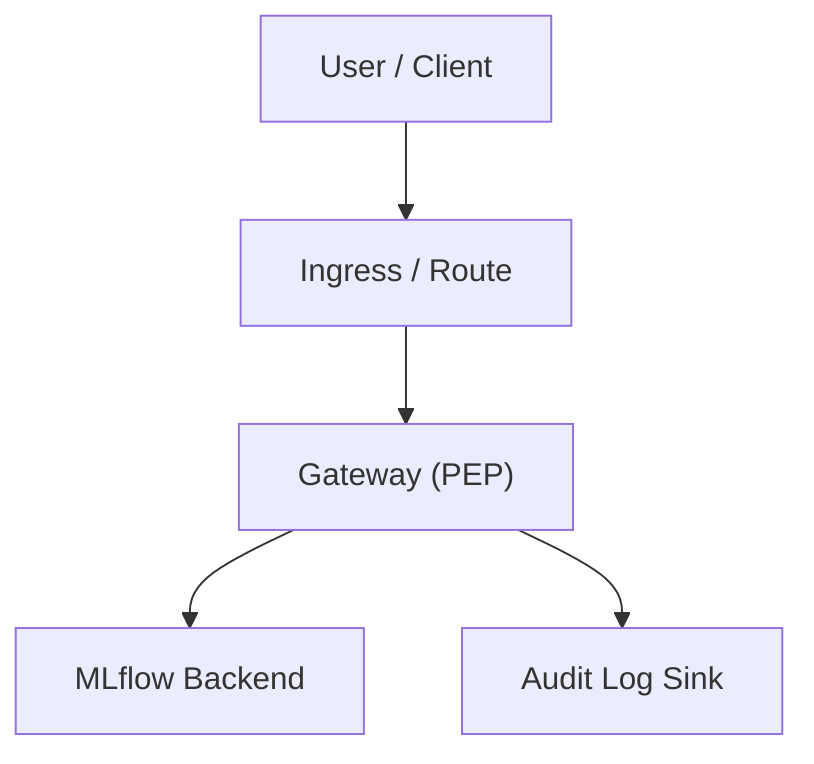
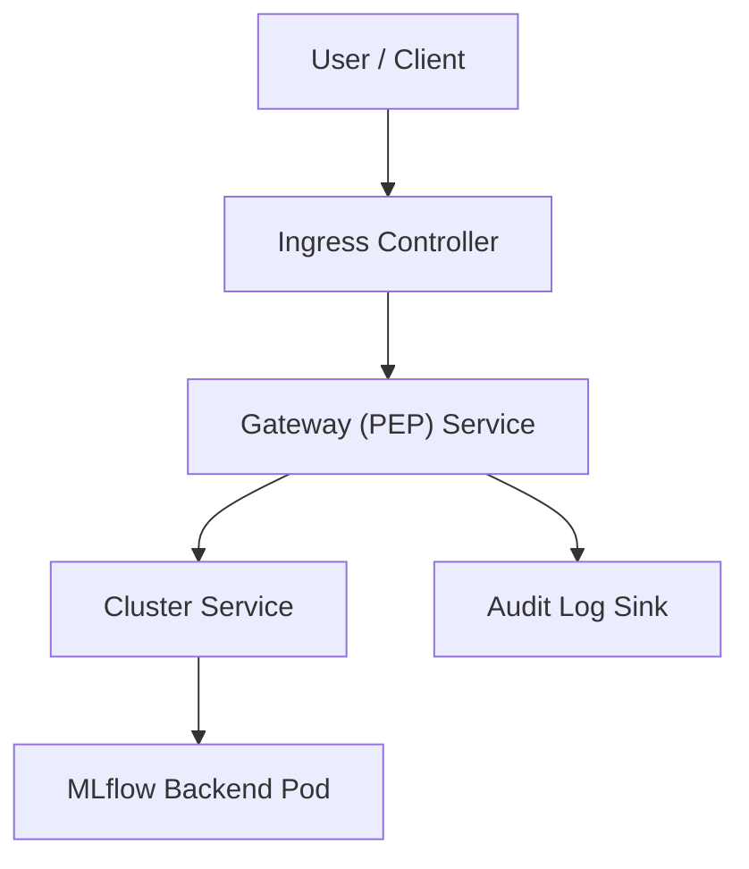

Enterprise multi-tenant security, RBAC, and audit layer for self-hosted MLflow.

# MLflow Multi-Tenancy & Governance Gateway

Policy Enforcement Gateway (PEP) for self-hosted MLflow. It adds tenant isolation, RBAC, audit logging, and OIDC-based IAM integration without modifying MLflow itself. The gateway sits in front of MLflow API/UI traffic and enforces policy before requests reach MLflow.

Self-hosted MLflow is strong for experiment tracking, but it does not provide enterprise multi-tenancy boundaries, built-in RBAC enforcement, centralized audit control, or robust IAM integration patterns out of the box. This project addresses that gap with an extension-layer gateway.

## When you need this

You likely need this gateway if:

- you run MLflow in a shared enterprise environment
- multiple teams or tenants use the same MLflow instance
- security, RBAC, and auditability are required for compliance
- direct MLflow exposure is not allowed by policy

## Why this exists

- Problem:
  - no tenant isolation control point
  - no role-based authorization boundary
  - no centralized audit decision logs
  - weak IAM integration for enterprise SSO/JWT flows
- Solution:
  - place a dedicated PEP in front of MLflow
  - enforce authn/authz/tenant policy at request time
  - keep MLflow upstream intact (no fork, no MLflow code patching)

## Key features

- Tenant isolation for MLflow Runs and Model Registry MVP endpoints.
- Minimal RBAC (`viewer`, `contributor`, `admin`) enforced in OIDC mode.
- OIDC JWT validation with configurable tenant and role claim mapping.
- Structured audit logging, including deny events.
- Request correlation ID (`X-Request-ID`) in responses and audit events for traceability.
- Configurable tenant tag key (`TENANT_TAG_KEY` / `GW_TENANT_TAG_KEY`).
- Kubernetes/OpenShift gateway-only deployment manifests and minimal Helm chart.

## Related work and positioning

Many MLflow deployments use authentication-focused proxy patterns in front of MLflow (for example OIDC-enabled reverse proxies). Those approaches typically provide:

- OIDC login and token/session handling
- SSO/session protection for UI/API access
- coarse-grained service-level access control

This project focuses on governance at the MLflow API boundary:

- tenant isolation for runs and model registry operations
- role-based access control per action
- structured audit logging for policy decisions
- policy enforcement without modifying MLflow core

The gateway is complementary to authentication proxy setups, not a replacement. Authentication can be handled by existing proxy/IdP layers, while this gateway enforces tenant-aware authorization and audit controls on MLflow API traffic.

## SSO deployment option (oauth2-proxy)

For enterprise SSO, you can place `oauth2-proxy` in front of this gateway:

- `oauth2-proxy` handles login, SSO session, and IdP interaction.
- this gateway handles tenant isolation, RBAC, and audit controls.

Recommended request path:

`User -> Ingress/Route -> oauth2-proxy -> MLflow Governance Gateway -> MLflow`

This gives a free/open-source SSO path while keeping governance enforcement at the MLflow API boundary.

## Quickstart

### 1) Clone and install

```bash
git clone https://github.com/<your-org>/mlflow-enterprise-gateway.git
cd mlflow-enterprise-gateway
python3.11 -m venv .venv
.venv/bin/python -m pip install -U pip
.venv/bin/python -m pip install -e '.[dev]'
```

### 2) Run tests

```bash
.venv/bin/python -m pytest -q
```

### 3) Start local stack

```bash
docker compose up --build
```

### 4) Smoke check

```bash
curl -sS http://localhost:8000/healthz
curl -sS http://localhost:8000/readyz
```

`/healthz` is a liveness probe (process is running). `/readyz` is a readiness probe and returns `200` only when MLflow upstream is reachable (`503` otherwise).

Kubernetes probe example:

```yaml
livenessProbe:
  httpGet:
    path: /healthz
    port: 8000
readinessProbe:
  httpGet:
    path: /readyz
    port: 8000
```

## Authentication modes

- `AUTH_MODE=oidc` (production):
  - validates JWTs via OIDC/JWKS
  - tenant is extracted from JWT claim (`GW_TENANT_CLAIM`)
  - RBAC enforced from claims (`GW_ROLE_CLAIM` and aliases)
  - `X-Tenant` header is rejected
- `AUTH_MODE=off` (dev/demo):
  - JWT validation bypassed
  - `X-Tenant` required, `X-Subject` optional
  - `Authorization` ignored and not forwarded upstream
  - useful for local tenant-isolation demos only

## Architecture snapshot



## Kubernetes deployment overview



## Production architecture principles

- Expose only the Gateway via Ingress/Route; keep MLflow internal as `ClusterIP`.
- Enforce NetworkPolicy so only Gateway pods can reach MLflow service endpoints.
- Use OIDC mode in production; `AUTH_MODE=off` is for demo/dev only.
- Enforce tenant isolation at the MLflow API boundary; clients should use the Gateway URL.
- Capture audit logs with correlation fields such as tenant, subject, path, and status.
- Set ingress/gateway timeouts and request size limits to protect stability under load.
- Scale Gateway horizontally (stateless) and manage config via env/ConfigMap/Secret.
- Terminate TLS at Ingress/Route; consider in-cluster mTLS as a future hardening step.

### Common pitfalls

- Exposing MLflow externally bypasses gateway policy enforcement.
- Existing resources without expected tenant tags can be denied by tenant checks.
- Misconfigured role-claim or alias mapping can cause unexpected `403` responses.
- Clients still pointed to MLflow directly will bypass governance controls.

## Supported MLflow endpoints (implemented)

Tenant policy and RBAC are currently enforced for:

- Runs:
  - `/api/2.0/mlflow/runs/create` and `/api/2.1/mlflow/runs/create`
  - `/api/2.0/mlflow/runs/get` and `/api/2.1/mlflow/runs/get`
  - `/api/2.0/mlflow/runs/search` and `/api/2.1/mlflow/runs/search`
- Model Registry:
  - `/api/2.0/mlflow/registered-models/create` and `/api/2.1/mlflow/registered-models/create`
  - `/api/2.0/mlflow/registered-models/get` and `/api/2.1/mlflow/registered-models/get`
  - `/api/2.0/mlflow/registered-models/search` and `/api/2.1/mlflow/registered-models/search`
  - `/api/2.0/mlflow/model-versions/create` and `/api/2.1/mlflow/model-versions/create`
  - `/api/2.0/mlflow/model-versions/get` and `/api/2.1/mlflow/model-versions/get`

## Docs

- Integration guide: `docs/integration.md`
- RBAC guide: `docs/rbac.md`
- Audit schema guide: `docs/audit.md`
- Kubernetes architecture: `docs/kubernetes-architecture.md`
- OpenShift architecture: `docs/openshift-architecture.md`

## Roadmap

See `ROADMAP.md` for next-release scope and current release priorities.

## Support and community

Issues and PRs are welcome. For bug reports, feature requests, and security guidance, use:

- `CONTRIBUTING.md`
- `SECURITY.md`
